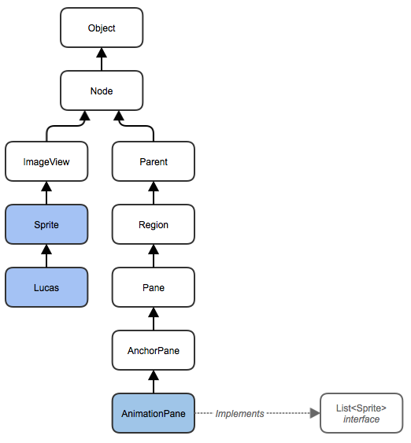

#Sprite Animations

In this assignment you will work with a partner to construct a scene containing an animated characters created from a sprite sheet images. Each of you will add your character to a one scene.

Included in the starting code is a class called `ExampleApp` that has an example of a single animated character in a scene. Below is a sprite sheet image that is used in this example:

As you can see, the image contains three animations, one on each row. You will be using predefined classes from the `sprite` package. This package contains a class called `Sprite` that can extended to create animations. The `Sprite` class itself extends the Java `ImageView` class, but adds extra functionality. 

`Sprite` objects can then be added to the `AnimationPane` which extends the Java `AnchorPane` class, but keeps track of a list of `Sprite` objects through the `List` interface. The diagram below illustrates how these classes fit into the overall Java hierarchy of classes:

The `ExampleApp` uses a class called `Lucas` that extends the `Sprite` class. You should us this as an example of how to create a variety of animations from a single sprite sheet image.

In consultation with your partner, chose a theme for your scene and find a background image (resize it if necessary). Next, each of your each find a different sprite sheet image, then create a class for your character that extends the `Sprite` class. You should create the scene with both of your characters in the `MainApp` class. 

Chose one student to be the "Project Leader". They will fork the repository from GitHub first and then add the other student as a collaborator. [Here are instructions on how to add collaborators](https://help.github.com/articles/adding-collaborators-to-a-personal-repository/). Both students can then checkout the project from GitHub and work together. You should regularly **Push** your code and also **Fetch & Merge** from the master branch to make sure that you have the latest version of each others code.